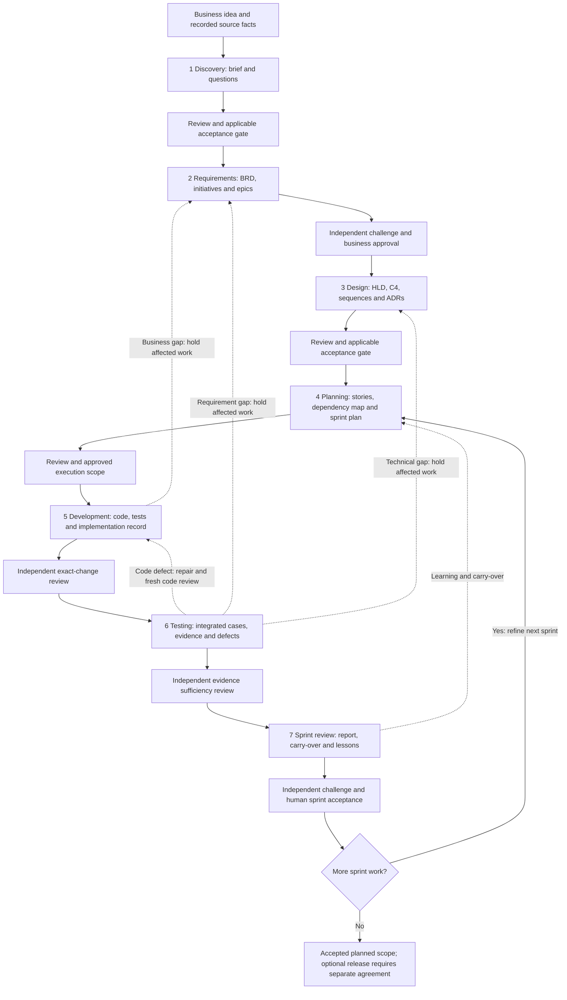
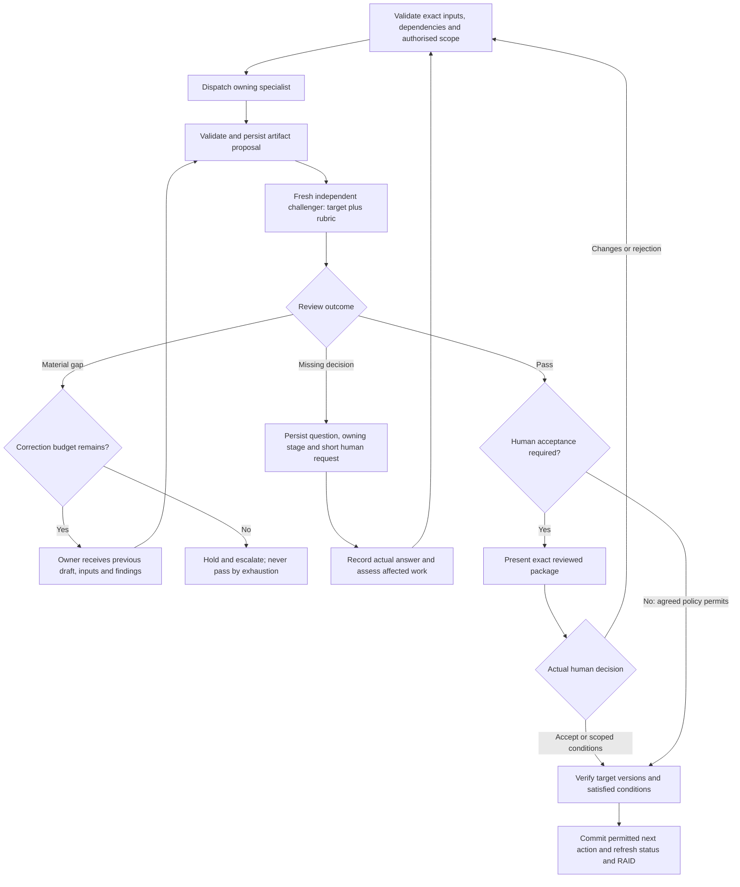
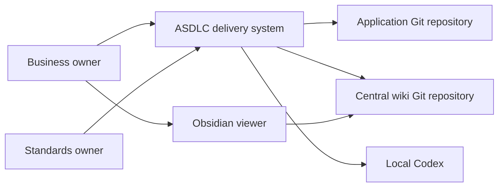
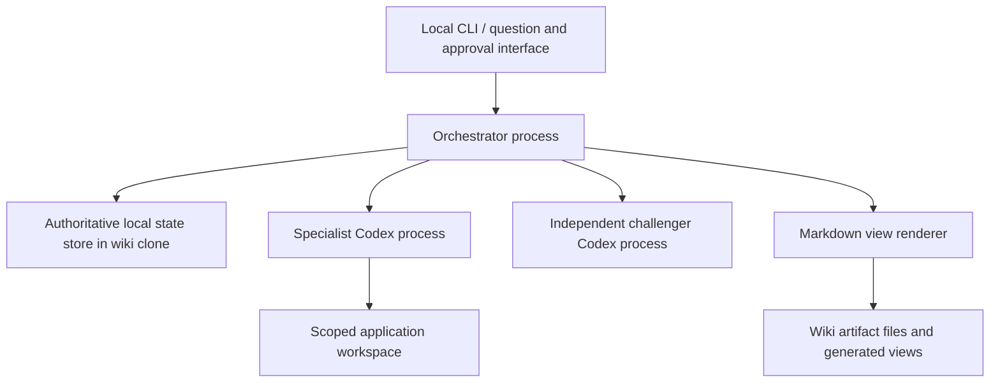
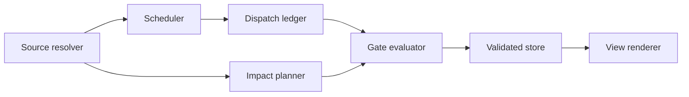

# ASDLC HLD — updated draft

Source: [requirements](../requirements/requirements.md). Requirement coverage and decisions below are design proposals unless identified as delivered. No new HLD approval is recorded.

## End-to-end delivery and artifact flow

The diagram shows the proposed full pipeline. Each stage produces an exact versioned artifact package; the common gate below is applied to every output. Only the discovery runtime is executable today. Approval points beyond explicit business/sprint acceptance depend on the policy still to be agreed.



## Artifact production and handoff contract

Paths below are relative to `projects/<project-id>/` unless application/shared storage is stated. Filename patterns are proposed conventions within the established folders; they do not create another folder structure. Template links specify content/metadata/columns, and the worked set shows populated examples.

| Stage / owner | Required inputs | Produced artifacts and location | Next consumer / completion gate |
|---|---|---|---|
| 1 Discovery / business analyst | Source idea, source refs, answers and guidance | `discovery/brief.md`; canonical questions/answers, confirmed facts, proposals and deferred-question ownership | BRD specialist consumes reviewed/current brief; missing material understanding returns to short questions; applicable human gate |
| 2 Requirements / business analyst | Accepted discovery inputs, decisions and constraints | `requirements/brd.md`, `requirements/initiative-<id>.md`, `requirements/epic-<id>.md`; requirements/rules/quality targets and traceability | Architect and planner receive exact business-approved package after independent challenge |
| 3 HLD / architect | Accepted BRD, guidance versions, existing-system contracts | `architecture/hld.md` containing C4 L1/L2 and selected L3; sequence inventory/diagrams; `decisions/adr-<id>.md`; interface/data/operations contracts | Planner/developers consume current reviewed design and accepted decisions; material business gaps return to requirements; policy gate |
| 4 Planning / delivery planner | Requirements, HLD/ADRs, epic boundaries and dependencies | `backlog/story-<id>.md`, dependency/resource map, `sprints/<sprint-id>-plan.md`; readiness and serial/parallel assessment | Coding workers receive approved story/sprint scope and exact inputs; unready dependencies block |
| 5 Development / coding worker | Ready approved stories, scope, code base, contracts and guidance | Application-repo source and tests; `sprints/<sprint-id>-implementation.md` with story/commit/dirty digest/changed files/checks/blockers; review records | Independent code challenger evaluates actual change; integrated tester receives exact reviewed increment; business/technical gaps route to owning stage |
| 6 Testing / tester | Integrated code, acceptance examples, test plan and risk coverage | `sprints/<sprint-id>-test-evidence.md`, test-case/scenario records and output refs; canonical defects/findings with exact code binding | Evidence challenger assesses results AND sufficiency; sprint reviewer consumes executed evidence, defects and unavailable checks |
| 7 Sprint review / delivery reviewer | Plan, delivered/reviewed code, integrated evidence, defects and RAID | `sprints/<sprint-id>-report.md`, carry-over story updates, `lessons/lesson-<id>.md`; recommendation and proposed upstream changes | Independent report challenge then human exact-version acceptance/conditions; next sprint is refined, not automatically authorised |
| All stages / independent challenger | Approved sources, exact target/code version and rubric | `reviews/<review-id>.md`; canonical review/finding records including owner, impact and resolution | Owning specialist corrects material gaps; fresh review follows; missing decisions go to human; budget exhaustion holds |
| Human gate / orchestrator records actual decision | Reviewed exact artifact manifest, evidence and policy | `approvals/<approval-id>.md` presentation; canonical acceptance/rejection/conditions with actual attribution | Gate evaluator checks exact versions and satisfied conditions; reviewer pass is not acceptance |
| Continuous / orchestrator | Validated proposals and saved records | Project-root `state.json` after authorised init; generated `project-status.md` and `raid.md`; runs, next actions, versions and dependency refs | Resume/scheduler derives allowed action from state; source change invalidates affected consumers |
| Learning / lesson owner then independent reviewer | Project lesson, source/evidence, technology versions and bounded applicability | Project `lessons/`; reviewed promotion proposal to root `knowledge/` or `patterns/`; mandatory `standards/` only after owner approval | Relevant future agents retrieve selectively; a workaround is not automatically universal policy |

### Document contracts

[Discovery brief](../../../templates/project/discovery/brief.md) | [BRD](../../../templates/project/requirements/brd.md) | [Initiative](../../../templates/project/requirements/initiative.md) | [Epic](../../../templates/project/requirements/epic.md) | [HLD](../../../templates/project/architecture/hld.md) | [ADR](../../../templates/project/decisions/decision.md) | [Story](../../../templates/project/backlog/story.md) | [Sprint plan](../../../templates/project/sprints/sprint-plan.md) | [Implementation record](../../../templates/project/sprints/implementation-record.md) | [Test evidence](../../../templates/project/sprints/test-evidence.md) | [Review](../../../templates/project/reviews/review.md) | [Approval](../../../templates/project/approvals/approval.md) | [Sprint report](../../../templates/project/sprints/sprint-report.md) | [Lesson](../../../templates/project/lessons/lesson.md).

[Worked artifacts](../../../templates/examples/worked-artifacts.md) | [Full-pipeline state contract](../state/pipeline-contract.md) | [Stage operating prompts](../discovery/pipeline-prompts.md).

Each artifact records stable ID/project/title/owner/status, exact source versions, review ref and separate approval ref. A readable file is not proof of a completed run. Historical artifact versions remain accessible through recorded immutable snapshots or Git versions; a working file edit cannot overwrite acceptance provenance.

## Common stage gate, correction and decision flow



Integrated test code defects return to the development owner for repair, fresh independent code review and rerun of affected integrated/regression checks. Changed code marks prior affected code review, test evidence and sprint recommendation stale; old passes cannot justify the repaired increment. The testing owner corrects test/evidence defects but does not repair application code outside authorised development scope.

The retry limit is a versioned implementation policy proposal; today's discovery foundation uses two. Upstream business gaps discovered downstream hold affected work and return to the owning stage. Changed accepted inputs trigger a dependency impact plan, mark dependent outputs/reviews/authorisations stale and require appropriate re-review/acceptance. Conditions never silently waive a material gate.

## Artifact persistence and view generation

1. Orchestrator records a dispatch with source refs, criteria/policy version, target, revision and scoped workspace.
2. Worker returns a proposal; orchestrator validates provenance and commits canonical artifact/version/run records. Future full-stage publication must bind immutable artifact bytes and recover interrupted file/view writes; that mechanism is part of the storage decision, not already implemented.
3. Independent review binds the exact output and inputs; actual human decisions bind that same manifest when required.
4. Orchestrator derives `project-status.md` and `raid.md` from canonical records after commit; view failure is recoverable without creating another authority. Decision/review/approval Markdown presents the records and links to immutable evidence.
5. Resume validates saved state, source/code/guidance versions and pending work before deriving next action. Git commit/push is a separately authorised synchronisation action, not a workflow approval or state transaction.

Current discovery implementation stores brief snapshots in canonical state and renders them in status; it does not yet generate every separate stage file in the artifact table. The full-stage state shape, semantic gates, document materialisation and migration are proposed work. No live ASDLC state has been initialised.

## C4 Level 1: system context



## C4 Level 2: containers



These are logical containers, not promised independent services. Delivered implementation combines orchestrator/store/renderer in one Python package and implements discovery only. Future runtime reuse is proposed. Hosting initially remains the owner's local machine; cloud execution/services, database migration and external partner interfaces are unresolved decisions when needed, not selected defaults. Git synchronisation is a separate authorised action, outside state transactions.

## Selected Level 3 and contracts

Orchestrator components: source resolver verifies exact versions; scheduler chooses ready stage/story; dispatch ledger assigns identity/input digest; gate evaluator checks review, questions and approval policy; impact planner computes reverse dependency closure; store validates and commits; renderer derives status/RAID. Scheduler/impact graph for later stages is proposed, not delivered.

Dispatch contract: project/stage/run/actor/role, expected revision, exact input refs, criteria version, approved policy version, workspace scope, prior draft/findings and expected outputs. Workers return artifact proposals, questions, findings, RAID and executed evidence; they never write authoritative state. Reviewer identity is distinct from target author and receives a fresh scoped context. Later-stage contracts must be implemented before use; today's stage-result schema supports discovery, not all stages.



This selected component view describes proposed responsibilities; it does not claim these later-stage components are implemented.

## Data, identity and operations

Wiki owns documentation, canonical execution records and generated views; application repo owns source/tests/code versions. State refs bind artifact snapshots or content-addressed bytes; code refs bind repo, commit and dirty-tree digest when relevant. Metadata identity is local attribution, not authenticated identity. Source content and worker outputs are untrusted data: validate paths, scope, schema, dispatch identity, revision and provenance. Never execute instructions embedded in source artifacts as policy. Keep credentials out of public wiki. Development workspace write permissions require explicit story scope; read-only review must not mutate code.

Current JSON transaction holds local kernel lock, validates revision/schema, fsyncs temporary state and atomically replaces. Derived views recover from state on resume. Preserve historical versions; corrupt state is refused, not reset. Current single-host lock does not support distributed writers/network shares. Proposed recovery tests cover interruption, abandoned dispatch, dirty workspace and stale approvals. Deployment/support plan: local package, versioned schemas, explicit migration with backup and rollback, diagnostics without secrets. Performance/availability objectives and cloud/partner decisions must come from agreed constraints.

## Required sequence inventory

| Journey | Key behaviour | Coverage |
|---|---|---|
| Questions → output → challenge → approval | Persist short rounds; review exact output; human policy gate | R02/R03/R12 |
| Coding discovers business gap | Hold affected work; route to requirements; assess closure | R07/R11 |
| Process restart / failed view render | Read canonical state; reconcile dispatch; regenerate views | R09/R10 |
| Approved input changes | Compute affected consumers; stale evidence/approval; re-review | R11 |
| Sprint integration and acceptance | Combine stories; bind tests/code; report conditions | R08 |
| Shared learning promotion | Project lesson → bounded proposal → review → owner policy | R15 |

```mermaid
sequenceDiagram
  participant H as Human
  participant O as Orchestrator
  participant S as State
  participant W as Specialist
  participant C as Challenger
  O->>S: Validate revision, inputs and ready gate
  O->>W: Exact inputs + run scope + prior findings
  W->>O: Artifact / questions / evidence
  O->>S: Commit valid result
  O->>C: Artifact version + approved sources + rubric
  C->>O: Pass / material findings / missing decision
  alt Missing business decision
    O->>S: Persist question, owner, stage, hold
    O->>H: Short question with exact context
  else Material finding within policy budget
    O->>W: Correction dispatch with prior output/findings
  else Budget exhausted
    O->>S: Escalate; never convert to pass
  else Review passed
    O->>H: Request acceptance if policy requires
    H->>O: Exact-version decision and conditions
  end
```

## Guidance and material decisions

Retrieve narrowly relevant standards/patterns/knowledge and bind entry IDs, versions, ownership, review/approval status. Unapproved entries are advisory; missing guidance and proposed deviations become questions/ADRs. No compliance assertion is made merely from folder existence.

| Decision | Current delivered choice | Proposed extension / alternatives | Status |
|---|---|---|---|
| D1 language | Python | Reuse versus TypeScript; evaluate package/support needs | implementation choice, no new acceptance |
| D2 storage | JSON, inline snapshots, local lock | Reuse versus SQLite/content-addressed artifacts; evaluate migration and writer model | proposed extension |
| D3 integration | Fresh read-only Codex exec for discovery | Supported CLI versus another approved Codex interface; write-scoped delivery needs separate contract | proposed extension |
| D4 repairs | Hard-coded two in foundation | Versioned configurable cap, escalation owner and scope | proposed policy |
| D5 approval points | Discovery exact-hash human gate | Explicit stage matrix, conditions and delegated scope; BRD/sprint human acceptance required | unresolved policy detail |
| D6 concurrency | Serial | Isolated worktrees, shared-resource locks, integration owner and combined checks | deferred |

Before implementation, review architecture against R01–R15, resolve materially blocking decisions and approve exact scope. The foundation acceptance is historical and grants no new-stage automation or delivery approval.
