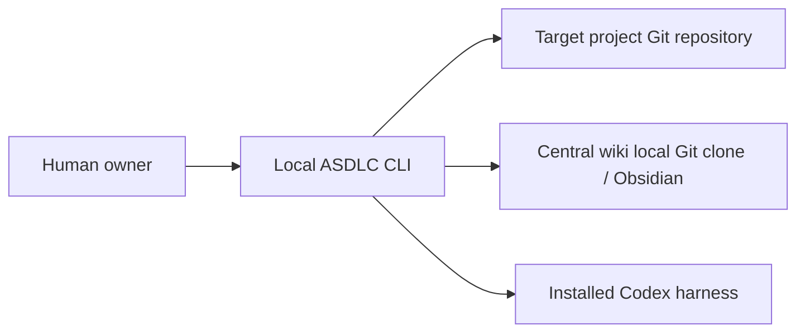
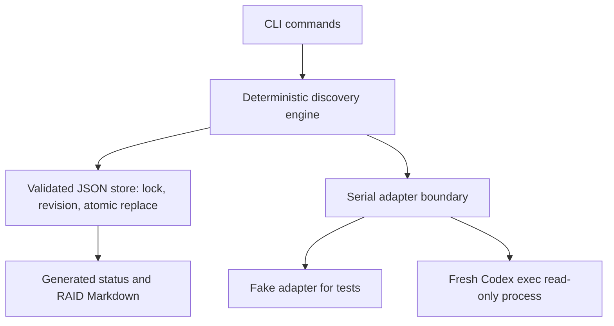
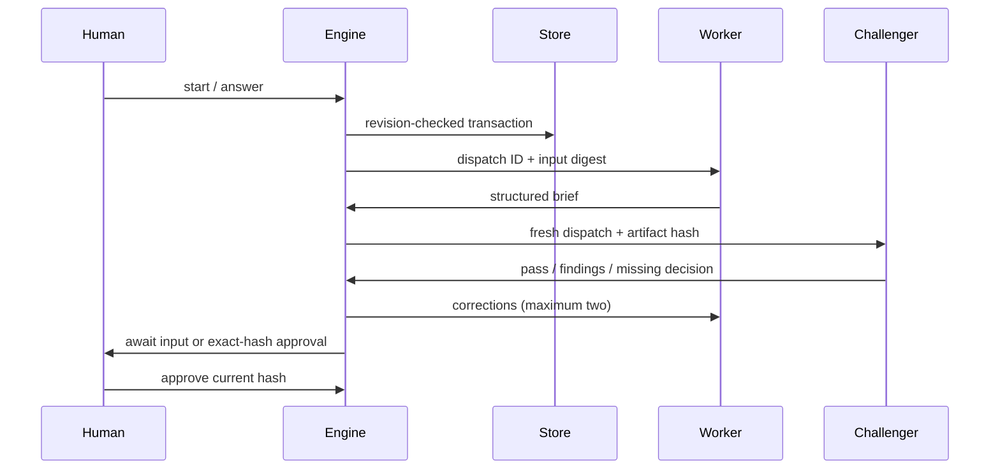

# Architecture — DRAFT, human approval pending

## Boundaries

The tool repo holds runtime/prompts/schemas. Target repo holds application source. Wiki root holds standards/, patterns/ and projects/{id}/state.json plus generated project-status.md and raid.md. No GitHub remote invented. Config stores local target path and fixture flag; existing Git target required. First version handles discovery only. Later stage ordering is documented; runtime refuses unsupported live delivery.

Canonical state is one versioned JSON envelope with artifact content snapshots, hashes, input digest, dispatch identity, results, reviews and approval history. Hashes use canonical JSON SHA-256. Reviews bind to artifact hash and dispatched owner identity; changing questions/answers/input invalidates discovery, review and approvals. Future dependent-stage invalidation traverses explicit input graph; not implemented for later stages yet. Future test evidence binds commit plus dirty-tree digest, command, outcome and artifact hashes.

Discovery additionally snapshots Markdown under wiki standards/ and patterns/ into the input digest. Resume or mutation detects changed resources, commits invalidation and refuses stale action dispatch. Workers consume the bound snapshots. Historical drafts/findings survive invalidation and are explicitly passed as stale correction context. Blocking questions/findings produce generated RAID records; answers/passing review close corresponding records. Stable worker RAID proposals are validated and applied by the orchestrator with preserved creation dates. This is evidence-integrity validation, not cryptographic authentication against a hostile local state editor.

One orchestrator transaction holds a kernel lock, validates expected revision, validates resulting schema, fsyncs temporary state and atomically replaces state. Markdown views follow commit and are regenerated on resume; state remains authoritative if rendering fails. Locks release on process death; lock file remains harmless. Network shares/distributed writers unsupported. JSON schema rejects unknown fields. Corrupt state is refused, never silently reset. Generated views labelled owned; source docs separate and never overwritten. Git sync remains manual and outside transactions.

Decisions: D1 Python fits empty repo and available 3.10.6; alternative TypeScript has no existing code advantage. D2 JSON plus OS lock instead of database for serial single-host operation. D3 inline immutable snapshots avoid multi-file artifact/state commit gaps; larger artifacts may later use content-addressed storage. D4 read-only Codex exec, fresh invocation for independence; no API runtime/key required. No worker gets a state-writing interface. The CLI trusts the local human: actor attribution is audit metadata, not identity authentication. Parallelism later needs isolated worktrees, dependency scheduling, integration owner and code evidence invalidation.

Harness verified 5 October 2026: installed codex-cli 0.160.0 supports `exec`, stdin prompts, `--ephemeral`, `--sandbox read-only`, `--output-schema` and `--output-last-message`. [Official noninteractive documentation](https://developers.openai.com/codex/noninteractive) confirms schema output and saved CLI authentication. Existing account limits apply; no new authentication/billing mechanism adopted. Real smoke must be reported separately; help output is not integration proof.
