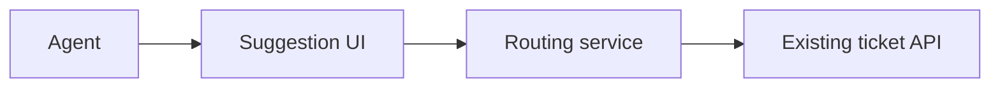

# Worked artifact examples

Every fact, decision, result and approval below is synthetic teaching material. Nothing here is real executed evidence or acceptance. Instantiated documents use metadata `id`, `project_id`, `title`, `status`, `owner`, `source_versions` (ID/version/hash), `review_ref`, `approval_ref`. Exact file hashes use raw file bytes; canonical structured-content hashes use canonical JSON. They are not interchangeable.

## Discovery brief DISC-001

Example source F01 says agents manually route support email and the owner wants fewer incorrect assignments. Current process: read → classify → assign → manually reassign on error. Proposed future: suggest queue → agent confirms → assignment recorded. Outcome O1: reduce incorrect assignments; numeric target/measurement owner are unknown Q1, owned by business owner and due before BRD acceptance. Scope: suggested routing of email; exclude staffing and other channels. Rule proposal: unsupported categories remain in manual triage. Constraints: existing ticket API. This brief is draft, with no inferred agreement.

## BRD BRD-001

Business need: manual reassignment wastes agent time. Actors: support agent and routing owner. Future process retains human confirmation. Scope/exclusions derive from F01. Example owner answer A1 confirms that suggestions must never auto-assign; no performance target is invented.

| Requirement | Shall behaviour | Source / outcome | Measure | Evidence | Epic |
|---|---|---|---|---|---|
| R-T01 | System shall require agent confirmation before assigning a suggested queue. | A1 / O1 | Zero assignments without confirmation in acceptance cases | TC1/TC2 | E-T01 |
| R-T02 | Unsupported category shall retain the ticket in manual triage. | Example agreed rule B1 / O1 | All unsupported-category cases remain unassigned | TC3 | E-T01 |

Rule B1: unsupported category → no suggested assignment; exception: authorised manual routing follows existing process. Dependency DEP1: API confirmation/update contract from ticket-system owner, due before HLD acceptance. Quality target for response latency remains Q2, not claimed as agreed. Trace O1→R-T01→I-T01/E-T01→ST1→TC1→exact code version.

## Initiative I-T01 and epic E-T01

| Initiative | Objective | Owner | Measures | Epics | Boundary |
|---|---|---|---|---|---|
| I-T01 | Reduce avoidable manual reassignment, O1 | Example routing owner | Incorrect assignments; numerical target pending Q1 | E-T01 | Email only |

| Epic | Parent | Capability | Requirements | Acceptance | Dependencies | Stories |
|---|---|---|---|---|---|---|
| E-T01 | I-T01 | Safe suggested queue routing | R-T01/R-T02 | Confirmation enforced, unsupported categories held | DEP1 | ST1/ST2 |

## HLD HLD-001

Context: agent uses suggestion UI; solution integrates with existing ticket system. Containers: UI, routing service and ticket-system API; no cloud product is selected without constraints. Selected component: confirmation handler checks category and explicit confirmation before calling assignment API. Data owner is existing ticket system; suggestion is transient. Failure: API timeout leaves assignment unknown, query authoritative ticket state before retry. Identity: existing agent identity; service credentials are outside the wiki. Hosting/latency target remain questions.



Sequence inventory: suggestion/confirmation, unsupported category, assignment timeout/reconciliation. ADR1 covers idempotency; consult applicable integration pattern version and record absence if none exists. Requirement coverage R-T01 confirmation handler; R-T02 classifier/manual path.

## Decision ADR1

Context: retries may duplicate side effects after timeout. Options: blind retry, idempotency key, query before retry. Proposed choice: idempotency key when API contract supports it, otherwise query/reconcile. Rationale: authoritative assignment state must not diverge. Owner: example API architect; status proposed pending DEP1. No decision is invented from the proposal.

## Story ST1

I-T01/E-T01; R-T01; purpose safe confirmation; HLD/ADR1 exact versions required before ready. Include confirmation guard; exclude suggestions algorithm and staffing. Acceptance: confirmed supported ticket updates once; missing confirmation never calls assignment. Dependencies: DEP1 and accepted ADR1. Shared resource `assignment-client`: ST2 also consumes it, so serial until stable contract and integration owner exist. Planned verification: unit guard and API contract TC1/TC2.

```gherkin
Scenario: No assignment without confirmation
  Given a supported ticket has a suggested queue
  When the agent has not confirmed the suggestion
  Then no assignment request is sent to the ticket system
```

## Sprint plan SP1

Goal: safe confirmation vertical slice. Scope ST1/ST2; excludes automatic routing. Preconditions: accepted BRD/HLD/story inputs and DEP1. Proposed serial order shared client → guard → unsupported-category path → integrated test. Owner: example integration agent. Review point: actual combined code and TC1–TC3 before report. Risks: timeout behaviour depends on contract; carry forward unresolved work, never label it accepted.

## Implementation record IMP1

Story ST1, input versions BRD1/HLD1/ADR1, application base CODE-BASE and resulting CODE-1. Example changed files: confirmation handler and tests. Status illustrative draft; no commands were executed here. Actual implementation must record exact repo commit, dirty-tree digest when applicable, scoped files, worker identity and independent review.

## Test evidence TE1

| Case | Requirement | Code ref | Command / method | Execution status | Outcome / evidence |
|---|---|---|---|---|---|
| TC1 confirmation update | R-T01 | CODE-1, exact hash supplied by real run | contract test command | planned | no result claimed |
| TC2 no confirmation | R-T01 | CODE-1 | unit guard test command | planned | no result claimed |
| TC3 unsupported category | R-T02 | CODE-1 | integrated acceptance command | unavailable in this example | test environment absent |

For executed cases record real start/end, command, exit status, output location and content hash. Planned/unavailable cases are not passes. Integrated sprint acceptance is held until sufficient evidence exists or an actual authorised scoped condition is recorded.

## Challenger report REV1

Author example-worker; reviewer example-challenger, different identity/fresh scoped context. Target ST1 version1; input BRD1/HLD1; rubric planning-v1.

| Finding | Severity/blocking | Location/evidence | Criterion / impact | Owning stage | Required resolution | Disposition |
|---|---|---|---|---|---|---|
| F1 | major/yes | ST1 dependency section lacks accepted DEP1 | Readiness; unsafe API assumptions | architecture | Resolve contract before coding | open |

Verdict changes_required. Correction receives same inputs, previous draft and F1. No human approval is inferred. A fresh report may pass with zero findings once the material issue is resolved.

## Approval record AP1

Illustrative pending request, not actual acceptance: target SP1 exact version/hash, prerequisite REV1 pass and exact code/test evidence when relevant. Actor/action/source/decision fields remain empty until the human responds. Conditions require ID, owner, scope, deadline/verification and satisfaction evidence. A changed target or input requires impact assessment; old acceptance remains historical.

## Sprint report SR1

Goal safe confirmation; planned ST1/ST2. Delivered none in this teaching example; verified none; accepted none. Carry-over both stories. Difficulty: authoritative timeout behaviour unresolved. Blocker DEP1; defect list has no executed observations. RAID dependency D1 owned by API architect due before coding. Lesson L1 proposes checking side-effect retry contract early. Recommendation hold because integrated evidence is absent. Changes requested: architecture contract, no silent scope reduction or optional release stage.

## Lesson L1 and shared proposal

Observation: timeout/idempotency ownership is easy to miss during planning; source REV1/F1. Example technology version unknown, so no version applicability is claimed. Proposal: include explicit retry/reconciliation question in integration design. Applies to side-effect APIs; does not prescribe keys for APIs that cannot support them. Duplication/contradiction checks and independent review must occur before shared promotion; standards-owner acceptance needed before mandatory policy. Status project-specific proposal.
