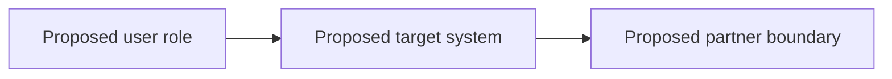
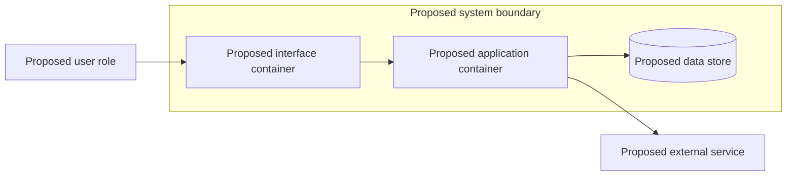
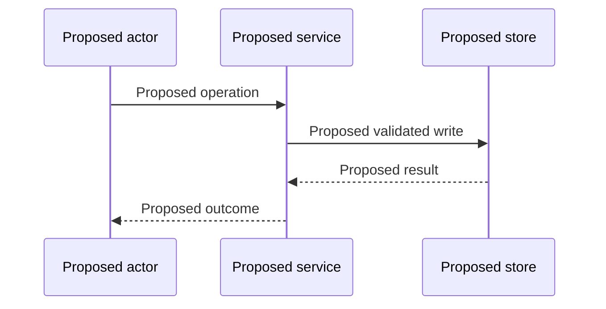

# Technical high-level design

Template: replace placeholders with sourced facts. Empty fields are unknown, never agreement. Record actual dates and exact source hashes when instantiated. This file confers no approval.

## Approved inputs and consulted guidance

| Source | Version / content digest | Status | Applied sections | Material impact |
|---|---|---|---|---|

Consult shared standards/ and patterns/. Record absence or unapproved status; do not invent an approved policy.

## C4 level 1: system context (replace proposed placeholders)

## C4 level 2: containers (replace proposed placeholders)

Specify responsibilities, technology, ownership, protocol and trust boundaries. Add component views only where they resolve important design questions.

## Important sequence / failure and recovery

Include errors, retries, idempotency and recovery paths for material workflows.

## Data, services and integrations

Record data ownership, system of record, partner contracts, authentication, cloud/service choices and lifecycle/retention. Material choices link decision records with alternatives.

## Operations and delivery boundaries

Observability, support, recovery, deployment constraints, costs and failure modes. Distinguish implemented capabilities from proposed design; record unresolved choices.

## Requirement coverage and exit

Map R-ID → design section → decision → verification. Challenger checks C4 levels, sequences, boundaries, operational feasibility, standards and missing business choices. Review and human approval bind exact inputs/artifact versions.
